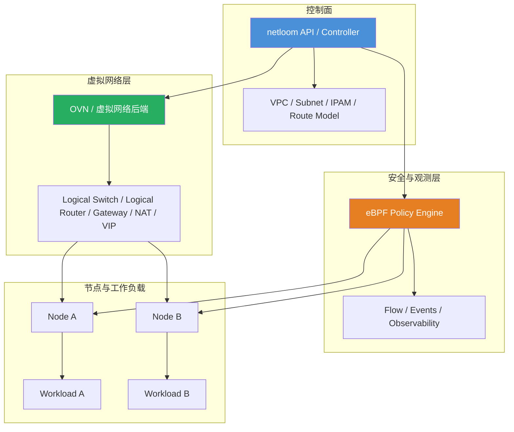

# netloom

[](https://goreportcard.com/report/github.com/jimyag/netloom)
[](https://codecov.io/gh/jimyag/netloom)
[](LICENSE)
[](https://github.com/jimyag/netloom/releases)

`netloom` 是一个使用 Go 编写的 SDN 软件项目。

## netloom 是什么意思

`netloom` 由 `net` 和 `loom` 两部分组成。

- `net` 表示 network，也就是网络。
- `loom` 表示织机，也有“编织”的意思。

所以 `netloom` 想表达的是：像织布一样去编排和组织网络，把原本分散的节点、链路、地址、路由和策略编织成一张可以统一描述、统一控制的虚拟网络。

这个名字更偏控制面语义，而不是单纯强调某个转发协议或某一种数据面实现。它适合用来描述一个负责 VPC、子网、IPAM、路由、网关和策略集成的 SDN 系统。

## 项目愿景

`netloom` 面向云网络和基础设施网络场景，目标是提供一套可编排的虚拟网络控制面，而不是依赖每台机器上的手工网络配置。

当前的方向包括：

- VPC 与虚拟网络抽象
- 子网与 IPAM 管理
- 逻辑交换与逻辑路由
- Gateway 与 NAT 编排
- 与 eBPF 安全策略能力集成

项目整体会保持简单、清晰、易维护：

- 使用 Go 实现控制面
- API 尽量小且行为明确
- 优先使用易读、易调试、易扩展的组件划分

## 架构方向

当前的设计方向，接近 `OVN + eBPF` 的职责拆分。

`netloom` 负责网络控制面的核心能力：

- VPC 与子网建模
- IPAM
- 逻辑网络拓扑
- 路由意图表达
- Gateway 编排
- VIP、负载均衡挂载等服务连接能力

eBPF 负责安全与可观测性相关能力：

- 类安全组的策略执行
- 主机与工作负载级别的包过滤
- 基于连接状态的策略控制
- 流量观测与排障数据

也就是说：

- `netloom` 负责定义网络
- eBPF 负责执行和观测安全策略

这和“Kube-OVN/OVN 负责虚拟网络，Cilium/eBPF 负责策略与观测”的整体思路接近，但 `netloom` 会保持自己的控制面边界和实现方式。

### 架构草图



这张图表达的是：

- `netloom` 作为控制面，负责管理网络模型与编排逻辑。
- OVN 风格的虚拟网络后端，负责实现逻辑交换、逻辑路由、Gateway、NAT 和 VIP。
- eBPF 负责策略执行和流量观测，不负责定义 VPC、子网或 IPAM。
- 工作负载同时受虚拟网络与 eBPF 策略影响，但两者的职责边界保持分离。

## 为什么不把安全策略全部放进 OVN ACL

OVN ACL 本身很适合做分布式虚拟网络策略，但它不是唯一选择。

这里更倾向于这样分工：

- 虚拟网络、地址分配、VPC、路由等能力放在 SDN 控制面
- 更复杂的安全组能力交给 eBPF

这样做的好处是：

- 网络与安全职责边界更清晰
- 更容易获得更强的策略能力和观测能力
- 降低虚拟网络拓扑与安全实现细节之间的耦合

但这并不意味着系统一定更简单。混合架构会增加控制面和排障复杂度，所以两侧的边界必须保持明确，避免出现多套策略系统同时生效、相互覆盖的问题。

## 范围

计划中的能力：

- 建模虚拟网络与子网
- 分配并回收 IP 地址
- 编排逻辑路由与 Gateway 行为
- 与 eBPF 策略引擎集成
- 提供清晰的面向运维和平台的接口

早期阶段的非目标：

- 从零重写所有数据面能力
- 在同一条路径上混用多套重叠策略系统
- 用过重的抽象隐藏控制面行为

## 当前状态

`netloom` 目前仍处于早期阶段，整体架构还在持续收敛，但仓库里已经有一条可运行的端到端路径。

当前仓库已经包含：

- 控制面模型：VPC、Subnet、Endpoint、RouteTable、PolicyRoute、Gateway、NATRule、SecurityGroup、CIDRGroup；Endpoint 可声明 Cilium 风格 labels 与 named ports。
- 控制面一致性校验：拒绝重复的 VPC/Subnet/Endpoint/SecurityGroup/Gateway 等对象身份，拒绝 Endpoint IP 冲突，并在写入后端前校验 VPC、Subnet、安全组、remote-group 和 LoadBalancer 绑定子网等引用关系。
- Subnet 支持 Kube-OVN `excludeIps` 类似的 `exclude_cidrs` 保留地址段，控制面会拒绝 endpoint 使用被排除的地址，IPAM allocator 也会跳过这些 CIDR。
- OVN 风格拓扑后端：真实 controller 路径使用本地 OVN NB model 和 libovsdb 直接写 OVN Northbound OVSDB，把 VPC logical router、Subnet logical switch/IPAM other_config、router port、router 类型 switch port、provider localnet port、Endpoint logical switch port、DHCP_Options、RouteTable static routes、static route BFD rows、PolicyRoute、Gateway router metadata、NAT rows、Load_Balancer rows、Load_Balancer_Health_Check rows 和 DNS records create/update/delete 到数据库；Gateway 覆盖集中式 chassis pin 与分布式网关元数据；NAT 覆盖 SNAT、DNAT、Floating IP (`dnat_and_snat`)、分布式 Floating IP 的 `logical_port`/`external_mac` 投影和 OVN NAT 端口映射；同名规则变更会按 desired state 替换旧 NAT 投影，并在控制面拒绝 EIP/端口冲突。typed writer 能在 steady-state 修复 core OVN name drift、Logical Router stale options/LB-group references、Router/Router Port disabled drift、Logical Switch stale ACL/QoS/forwarding/LB-group references、Subnet router/localnet port parent attachment drift、IPv6 router port RA drift、LoadBalancer router/switch parent attachment drift、Endpoint DHCP option family metadata、LSP DHCP attachment drift 与 DNS row/switch attachment drift。`ovn-nbctl` planner/executor 保留为内部 dry-run 和回归测试工具，不作为 controller 运行时后端。
- Endpoint 可声明 Kube-OVN 风格静态 `mac`，OVN 后端会把 MAC+IP 写入 logical switch port addresses 和 port security；控制面会拒绝同子网重复 MAC 以及与网关 router port MAC 冲突的静态 MAC。
- Linux 工作负载 datapath：支持本机 `/32`/`/128` 地址路由、`netns + veth` 多工作负载模式，以及基于 RPDB table/rule 的 IPv4/IPv6 策略路由下发；裸金属 agent 的网卡、netns、地址、路由和 RPDB 操作统一通过 `vishvananda/netlink`/`netns` 包执行。设置 `NETLOOM_OVSDB_ENDPOINT` 后，Provider Network 本地 OVS 状态会默认通过本地 Kube-OVN-derived `Open_vSwitch` OVSDB model 和 libovsdb 事务直接 create/update/mutate/delete `Open_vSwitch`、`Bridge`、`Controller`、`Port`、`Interface`、`QoS` 和 `Queue` rows；`NETLOOM_OVSDB_SYNC=1` 保留为显式同步开关。该路径会修复 Bridge.Controller、port-to-bridge、QoS 和 Queue 漂移并清理 stale Netloom-owned provider rows，并从同一个 libovsdb monitor/cache 读回 bridge mapping、port、interface、QoS、Queue、bridge controller 连接状态、多个 Controller 的本地连接 quorum 和 `Controller.status` 中的 target/state/role/last_error 生成 provider health issue，部分 controller 断连会报告 `degraded` 和 `connected=x/y` detail，避免依赖 `ovs-vsctl` 读写数据库。controller 也会在配置 `NETLOOM_OVSDB_ENDPOINT` 时把最近一轮 reconcile、OVN health、live audit、stale advisory 和 maintenance 摘要写入 `Open_vSwitch.external_ids:netloom_controller_status`，agent 会把最近一轮 policy/eBPF rollout、TCX、provider health 和错误摘要写入 `Open_vSwitch.external_ids:netloom_agent_status`，便于裸金属节点上直接从 OVSDB 审计控制面和节点 datapath 状态。ProviderNetwork 可声明 `isolation=exclusive`，在同一节点上拒绝和其他 provider network 共享 parent interface，并把隔离语义写入托管 OVSDB `external_ids` 方便审计；可声明 `controller_targets`，把 provider bridge 的 OpenFlow controller intent 写入 OVS `Controller` rows 并由 `Bridge.Controller` 引用；也可声明 `qos.egress_rate_bps`/`qos.egress_burst_bps`，把 provider link egress shaping 写入 OVS `QoS(type=linux-htb)`；还可声明 `tenant_queues`，把每个 VPC 租户的 queue id 与 min/max/burst rate 写入 OVS `Queue` rows 并挂到 provider port 的 `QoS.queues`，同时按该租户的 provider subnet CIDR、可选 TCP/UDP 端口、endpoint selector、identity selector 或共享 `identity_groups` 下发 OpenFlow `set_queue` 规则选择队列；`identity_groups` 可由外部目录/CMDB 同步为 VPC 内可复用分组，支持显式 endpoint id、selector/expression 成员关系、source/observed_at/ttl_seconds 元数据和过期拒绝，agent/controller 每轮 state-file reconcile 会在配置 `NETLOOM_OVSDB_ENDPOINT` 后从本机 `Open_vSwitch.external_ids:netloom_identity_group_observations` 合并本地运行时分组 feed，也可通过 `NETLOOM_IDENTITY_GROUPS_URL` 拉取 HTTP(S) 远程 feed，用 `NETLOOM_IDENTITY_GROUPS_BEARER_TOKEN` 携带 Bearer token，并通过 `NETLOOM_IDENTITY_GROUPS_TLS_CA_FILE`、`NETLOOM_IDENTITY_GROUPS_TLS_CERT_FILE`、`NETLOOM_IDENTITY_GROUPS_TLS_KEY_FILE` 启用私有 CA 和双向 TLS；长期运行时远程 feed 会使用 ETag/Last-Modified 条件请求，304 复用本地缓存，失败时按源级 backoff 复用上一份成功 feed，也可返回 `identity_group_patches` 增量文档对上一份成功远程快照执行 `upsert`/`delete`；同一 provider/tenant 下重叠的 identity group queue 会在控制面报冲突，并会投影为 endpoint-scoped `/32` 或 `/128` queue flow；解析后的 identity group snapshot 会写入 `Open_vSwitch.external_ids:netloom_identity_groups`，Queue row 仍记录 `netloom_queue_identity_groups` 引用，方便直接从 OVSDB 审计当前成员与引用关系；`tenant_quotas` 按 VPC 租户限制 provider network 上的 subnet/endpoint 使用量，并在 agent provider status 与 Prometheus 指标中暴露当前用量。
- Cilium 风格策略编译：把安全组规则编译为 endpoint-scoped policy map entry，并把 `remote_cidr`/`remote_group`/`remote_endpoint_selector`/`remote_endpoint_expressions`/`remote_service`/`remote_cidr_group`/`remote_entities`/`remote_fqdns` 保留为可按真实 remote IP 匹配的 CIDR 元数据；重叠 CIDR 会按最长前缀选择更具体规则，精确 identity 命中优先于 CIDR fallback；同一条规则展开出的等价相邻 CIDR 会自动压缩为更短前缀，降低 endpoint policy map 压力；安全组支持 Cilium `enableDefaultDeny=false` 类似的 `default_deny_ingress=false` / `default_deny_egress=false`，当 endpoint 绑定的所有安全组都显式关闭某方向 default deny 时，会生成最低优先级 wildcard allow，同时显式 drop/reject 仍优先生效；安全组支持 Kube-OVN 风格 `tier` 0/1，较小 tier 会先于较大 tier 生效，同一 tier 内 drop/reject 保持高于 allow/log，非零 rule priority 按 Kube-OVN `1..16384` 范围校验并采用较小数值优先；`remote_cidr` 支持 Cilium `except` 类似的 `except_cidrs` 差集展开；`remote_group` 会展开为 endpoint identity 与精确成员 CIDR，`remote_endpoint_selector`/`remote_endpoint_expressions` 会按 endpoint labels 展开为精确 endpoint identity/CIDR，并支持 Cilium/Kubernetes selector 的 `In`、`NotIn`、`Exists`、`DoesNotExist` 表达式，`remote_service` 采用 Cilium `toServices` 类似的 egress 语义并展开为同 VPC LoadBalancer 的全部 VIP frontend、协议和端口，`remote_cidr_group` 会按 desired-state `cidr_groups` 展开为多条 CIDR 规则，CIDRGroup 支持 Cilium CIDRSet 风格的 `entries[].except_cidrs`；`remote_entities` 支持 `all`/`world`/`world-ipv4`/`world-ipv6`/`cluster`/`private`/`host`/`remote-node`/`none`，其中 `world` 会展开为双栈默认 CIDR 扣除当前 VPC 子网后的外部地址集合，`world-ipv4`/`world-ipv6` 只展开对应 IP family，`none` 不生成规则，`host` 会展开为当前 VPC gateway LAN IP 的 /32 或 /128，`remote-node` 会展开为当前 VPC 中非本节点 gateway LAN IP 的 /32 或 /128，`remote_fqdns` 会按 desired-state `dns_records` 展开为 /32 或 /128 CIDR；支持 Cilium named port 风格的 `named_ports`，ingress 解析本 endpoint 命名端口，egress remote-group 或 remote_endpoint_selector 解析远端成员命名端口；ICMP 规则支持协议级、`icmp_type` 级和 `icmp_type`+`icmp_code` 级匹配；`action=reject` 会在 policy map/evaluator 中保留 reject verdict 与观测事件。
- Cilium 风格连接状态：stateful allow 规则会建立反向 conntrack 状态，反向流命中会刷新空闲时间；长运行 agent 会按 Cilium CT GC 思路清理 idle state，默认 5 分钟，可用 `NETLOOM_CONNTRACK_MAX_IDLE_MS` 调整；策略变化或 endpoint 删除时也会清理旧状态。
- Cilium 风格策略更新：policy map replace 会先计算 add/update/delete/unchanged diff，成功替换后递增 endpoint policy revision 并记录 audit event；audit event 会包含 previous/current revision、diff stats 和成功/失败结果，失败时记录 failed endpoint、attempted revision 与错误但不推进实际 revision；内存 store 具备事务回滚语义；agent 会汇总 policy map entries/capacity/pressure，并输出最高 pressure endpoint，便于定位接近容量上限的策略 map；可用 `NETLOOM_POLICY_GC_MAX_IDLE_MS` 启用非 desired endpoint policy map aging/GC，清理长期运行 agent 中残留的空闲策略状态；可用 `NETLOOM_POLICY_PRESSURE_MITIGATION_THRESHOLD` 在较低水位删除非 desired endpoint policy map，并用更高的 `NETLOOM_POLICY_PRESSURE_QUARANTINE_THRESHOLD` 控制 `NETLOOM_POLICY_PRESSURE_QUARANTINE` 的 desired endpoint fail-closed 隔离触发点，未设置 quarantine threshold 时沿用 mitigation threshold；长运行 agent 支持 endpoint policy reset、plan/dry-run、regenerate、quarantine、unquarantine 和 multi-endpoint rollout lifecycle action，rollout 支持 `pressure_aware=true` 按当前 policy-map pressure 自动把 batch size 降到安全下限；rollout 写入失败时会停止后续 endpoint，并把本轮已写入的 endpoint policy map 自动恢复到 rollout 前快照；设置 `slo_gated=true` 时，rollout 会在每个 batch 后读取 policy rule telemetry，若样本数达到 `slo_min_packets` 且 drop/reject 比例超过 `slo_drop_threshold_percent`，会判定 canary SLO 失败、回滚本轮已写 endpoint 并跳过后续 endpoint；可选 `slo_window_count`/`slo_window_interval_ms` 会基于 rollout 前 baseline 做多窗口 counter delta 评估，避免历史 drop 影响 canary 判断；rollout 还支持 HTTP/TCP `probes`，每个 batch 后主动探测真实入口，probe 失败会触发同一套回滚和跳过逻辑；`paused=true` 可显式暂停 rollout，`pause_after_batches` 可在完成指定 batch 数后自动暂停，`promotion_percent` 可把本轮 promotion 限制在 endpoint 总数的指定百分比，达到上限后自动暂停，恢复时移除或调高 pause/promotion 配置即可继续由 desired-state 驱动；`approval_required=true` 会在 `approved=true` 前只生成 rollout 计划并进入 approval pending pause，不写 live policy map；设置 `approval_expires_at` 后，过期审批即使 `approved=true` 也会 fail-closed 暂停并标记 `approval_expired`；设置 `approval_callback_url` 后，已审批 rollout 在写 live policy map 前会向外部审批系统 POST `approval_ref` 和 endpoint 列表，只有返回 `{"approved":true}` 才继续，拒绝或失败都会 fail-closed 暂停且不修改策略；设置 `ack_required=true` 后，rollout 会在写 live policy map 前要求 operator 明确设置 `acknowledged=true`，未确认时进入 `ack_pending` pause 并保留 `ack_ref` 供外部审计；设置 `ack_expires_at` 后，过期确认即使 `acknowledged=true` 也会 fail-closed 暂停并标记 `ack_expired`；设置 `change_poll_url` 后，rollout 会在写 live policy map 前向外部变更系统 POST `approval_ref` 和 endpoint 列表，只有返回 `{"allowed":true}` 或 `status` 为 `approved/open/ready/scheduled/implementing/in_progress` 才继续，拒绝或失败会进入 approval pending pause 且不修改策略；设置 `change_status_url` 后，rollout 会把 planned/applied/skipped/failed/paused/approval_pending/approval_expired/ack_pending/ack_expired 等结果 POST 给外部变更系统并记录同步结果，失败只进入 rollout 状态，不改变策略写入结果；desired-state 可声明 `policy_rollouts`，agent 会在存在当前节点 active rollout 时延迟常规 policy apply，并按声明的 endpoint 子集、batch size、pressure-aware、SLO-gated、probe、pause、approval、ack、external change poll、promotion 和外部状态同步设置渐进写入策略，同时在 reconcile 日志和 Prometheus 指标中输出 rollout planned/applied/skipped/failed/rolled_back/rollback_failed/slo_failed/probe_failed/paused；每个 rollout endpoint item 都会保留稳定 `reason`，区分 `operator_paused`、`approval_pending`、`approval_expired`、`ack_pending`、`ack_expired`、`pause_after_batch`、`promotion_limit`、`apply_failed`、`slo_failed`、`probe_failed`、`rollout_failed`、`rollback_failed` 和 `resumed_applied` 等状态来源，便于历史 API、外部变更系统和人工审计准确判断原因；配置 `NETLOOM_OVSDB_ENDPOINT` 时，desired-state rollout 会把 paused/failed rollout 中已应用的 endpoint 持久化到本地 OVS `Open_vSwitch.external_ids:netloom_policy_rollout_state`；下次 reconcile 会把这些 endpoint 标为 `resumed_applied` 并继续剩余 endpoint，完成后自动清理该状态；长运行 agent 会保留最近 128 条 manual/desired-state rollout history，并在配置 `NETLOOM_OVSDB_ENDPOINT` 时持久化到 `Open_vSwitch.external_ids:netloom_policy_rollout_history`，启动时从 OVSDB 重新加载，可通过 `GET /policy/endpoints/rollout/history` 查询；`netloom-agent policy-status` 会输出 endpoint policy lifecycle JSON，包括 revision、entries/capacity、pressure、drift、last stats 和 last update event。
- Cilium 风格可观测性：policy evaluator 会记录 allow/drop/conntrack/log 统计，为策略拒绝或无匹配 drop 生成 drop event，并为带 `log` 的规则或 `action=log` 生成 allow/drop policy event；dataplane 提供 `Explain`/`ExplainStateful` 查询接口，可返回 packet tuple 的 verdict、reason、匹配 rule cookie、匹配 entry、PMTU/NDP 特判以及 conntrack/stateful 标记，作为后续 CLI/API “为什么被放行或拒绝”的稳定数据面；agent reconcile 可从策略 telemetry provider 汇总 live rule packet/byte/allow/drop/reject/log counters，并在日志中输出 endpoint/rule 维度的 `policy_rule_stats`；eBPF policy store 会从 live pinned policy map value 读取 counter 字段，TCX attachment 会把 fast path map counters 合并回同一 telemetry 输出；周期 agent 可通过 `NETLOOM_AGENT_METRICS_ADDR` 暴露 Prometheus text metrics endpoint，用于 scrape 最新 reconcile、policy map pressure、policy map live-vs-desired drift、policy rule 和 TCX counters；reconcile drift repair 与 drift audit 都会忽略 counter 增长，避免误判健康 map。
- eBPF/TCX ACL datapath：支持节点接口和工作负载 veth 上的 IPv4/IPv6 CIDR+L4/ICMP ACL attach，TCX map 使用 LPM trie 匹配 peer CIDR、TCP/UDP 端口前缀范围以及 ICMP/ICMPv6 type/code 前缀；TCX L4 ACL map value 会保留 rule cookie、log 标记，并在 fast path 命中时原子递增 packet/byte counters；remote-group 和 remote-endpoint-selector 规则会沿用编译器生成的精确 endpoint `/32` 或 `/128` CIDR 投影到 TCX fast path，同时 userspace policy map 仍保留 Cilium 风格 remote identity 校验，非精确 endpoint CIDR 不会被 TCX 接受；ICMPv6 使用 next-header 58 编码 type/code；workload fast path 会按 ingress/egress 安全组方向投影到对应 TCX attach 点，agent 自动 attach 会按规则族选择 IPv4、IPv6 或双栈 TCX 程序，双栈场景通过 TCX multi-program anchor 将 IPv6 程序追加到同一接口/方向；TCX attach/update 失败会输出 failed target，TCX rule counters 会按 endpoint 或 shared TCX target 标注，便于定位具体 interface/direction/rule。
- 周期 reconcile：controller 和 agent 都能从 desired-state JSON 文件周期重读状态，controller 会清理从 desired state 删除的 OVN/内存对象，agent 会持有并按需替换 TCX attachment。

策略边界如下：

- `PolicyRoute` 属于 SDN 拓扑意图，由 topology/OVN 路由层处理，支持 reroute/drop 等路由动作；match 支持 source/destination CIDR、protocol、`src_ports` 和 `dst_ports`，OVN 会把多端口范围投影为分组 OR match，Linux datapath 会展开为 source/destination port 组合的 policy rule；reroute 统一使用 `next_hops` 表达单跳或 Kube-OVN/OVN 风格的多 next-hop ECMP，OVN backend 会投影到 `Logical_Router_Policy.nexthops`，Linux datapath 会投影为 multipath policy route，本地 resolver 会基于 flow hash 在 next-hop 集合中做稳定选择并保留完整 `next_hops` 验证视图；OVN backend 会按 desired state 替换同 priority/match 的 policy，避免 next-hop 或 action 更新后旧策略残留；控制面会拒绝同名策略路由或同一 VPC 内重复 priority/match 的策略路由。
- `RouteTable` 的静态路由统一使用 `next_hops` 表达单跳或 ECMP，默认路由、blackhole、单 next-hop 和 OVN `--ecmp` 多 next-hop 更新都会收敛到当前 desired state，本地 resolver 对静态 ECMP 也按 flow hash 选择稳定 next hop；静态路由可声明 `bfd`，direct libovsdb 路径会按每个 next-hop 创建 OVN NB `BFD` row，并把 `Logical_Router_Static_Route.bfd` 指向该 row；控制面会拒绝同一 VPC 内重复 destination 的静态路由，避免 OVN logical router 上出现歧义路由。
- 控制面会拒绝跨 IP family 的无效意图，包括静态路由 destination/next-hop、SNAT CIDR/external IP、DNAT/Floating IP external/target 以及 LoadBalancer VIP/backend 的 IPv4/IPv6 混配。
- Linux datapath 会把本节点本 VPC 的 `PolicyRoute` 下发为独立 route table 和 `ip rule`/netlink rule，支持 source/destination、TCP/UDP `sport`/`dport`、reroute 和 blackhole/drop；默认 netlink 后端会按 desired state 清理托管表范围内的旧 rule 并刷新当前表，`NETLOOM_POLICY_ROUTE_TABLE_BASE`/`NETLOOM_POLICY_ROUTE_TABLE_SIZE` 可调整表 ID 范围。
- `SecurityGroupRule` 属于 ACL 意图，由 eBPF-style policy map 和 TCX ACL datapath 执行。
- `action=reject` 在 policy map/evaluator 路径会保留为 `reject` verdict，并生成 `policy-reject` drop event；当前 TCX fast path 只能返回 pass/drop，因此可投影的 reject 规则会在 TCX 层按 drop 执行。
- `Endpoint.labels` 与 `Endpoint.named_ports` 可声明 Cilium 风格 endpoint metadata；安全组规则里的 `remote_endpoint_selector` 会用 labels 选择同 VPC endpoint，`remote_endpoint_expressions` 补充 Cilium/Kubernetes selector 的 `In`、`NotIn`、`Exists`、`DoesNotExist` 表达式，二者同时声明时按 AND 匹配并展开为 endpoint identity 与 /32 或 /128；`named_ports` 会在编译阶段解析成具体 TCP/UDP 端口，ingress 使用被保护 endpoint 的命名端口，egress 支持 `remote_group` 或 `remote_endpoint_selector`/`remote_endpoint_expressions` 并按远端成员各自命名端口展开。
- `remote_entities` 采用 Cilium `toEntities`/`fromEntities` 类似语义，支持 `all`、`world`、`world-ipv4`、`world-ipv6`、`cluster`、`private`、`host`、`remote-node` 和 `none`；`all` 会展开为 IPv4/IPv6 默认 CIDR，`world` 表示当前 VPC 子网之外的外部地址集合，`world-ipv4`/`world-ipv6` 只保留对应 IP family，`cluster` 会展开为当前 VPC 的子网 CIDR，`private` 会展开为 RFC1918 与 ULA CIDR，`host` 会展开为当前 VPC gateway LAN IP 的 /32 或 /128，`remote-node` 会展开为当前 VPC 中非本节点 gateway LAN IP 的 /32 或 /128，`none` 不生成任何策略条目。
- `remote_service` 采用 Cilium `toServices` 类似的 egress-only 语义，引用同 VPC 的 desired-state `LoadBalancer`，编译时把服务 VIP 展开为 /32 或 /128；LoadBalancer 可用 `ports` 声明多个 frontend，规则未显式指定协议或端口时会为每个 frontend 继承对应 protocol/port。
- `remote_cidr` 可声明 `except_cidrs`，编译器会把主 CIDR 拆成排除例外后的最小 CIDR 集合；和 Cilium 一样，例外 CIDR 必须包含在主 CIDR 内，且不和 `remote_cidr_group` 混用。
- `remote_cidr_group` 采用 Cilium `CIDRGroupRef`/`CIDRSet` 类似的安全组 CIDR 集合语义，CIDRGroup 作为 desired-state 对象集中维护可复用 CIDR 列表；既支持 `cidrs` 简写，也支持 `entries` 中为每个 CIDR 声明 `except_cidrs`，编译时会先做 CIDR 差集展开再写入 endpoint policy map。
- `remote_fqdns` 采用 Cilium `toFQDNs` 类似的安全组 egress 语义，支持 `match_name` 和 `match_pattern`，会从 desired-state `dns_records` 与运行时 DNS 观测缓存派生 CIDR policy entry；该运行时缓存从本机 `Open_vSwitch.external_ids:netloom_dns_observations` 读取，需配置 `NETLOOM_OVSDB_ENDPOINT`；`match_pattern` 采用 Cilium label wildcard 语义，普通 `*` 不跨 `.`，前缀 `**.` 可匹配一层或多层子域；`dns_records` 可通过 `ttl_seconds` + `observed_at` 表达 DNS cache TTL，过期记录不会编译进策略。
- ACL 不放到 OVN ACL 里实现，避免和 eBPF 策略路径重叠。
- DNAT 和 Floating IP 端口映射会校验协议意图；DNAT external/target 端口相同时投影为 OVN NAT `--portrange`，端口不同时直接创建 OVN `NAT` 行并设置 `external_port_range` 与 `logical_port_range`，Floating IP (`dnat_and_snat`) 端口映射也使用同一原生 NAT row 路径，避免为了端口转换引入额外 Load_Balancer 拓扑；分布式 Floating IP 可声明 OVN 原生的 `logical_port` 与 `external_mac`，两者必须成对出现在 `dnat_and_snat` 规则上；控制面仍把同一个 EIP+端口视为冲突，避免 NAT 投影互相覆盖。
- 控制面 resolver 会解析 DNAT 和 Floating IP (`dnat_and_snat`) 入站目标，用于在单元测试和 selftest 中验证 Kube-OVN 风格 NAT 语义。
- `LoadBalancer` 使用 OVN `lb-add`/`lr-lb-add`/`ls-lb-add` 表达 Kube-OVN 风格的 VPC Service VIP，并统一通过 `ports` 声明同一个 Service VIP 下的多个 frontend 和不同 target port；控制面会拒绝同 VPC 内重复的 VIP+协议+端口；支持 OVN `affinity_timeout` 形式的 ClientIP session affinity，并会投影 `selection_fields`，未显式声明时 session affinity 默认使用 IPv4 `ip_src` 或 IPv6 `ipv6_src`；支持 Kube-OVN/OVN 风格的 `Load_Balancer_Health_Check` 健康检查选项，多 frontend 会按 VIP 幂等复用并更新对应的 health check row；backend 可声明 `healthy=false` 从本地 resolver 与 OVN VIP backend 列表中剔除，未声明时默认健康，控制面要求每个 frontend 至少保留一个健康 backend；state-file controller 可设置 `NETLOOM_LB_HEALTH_PROBE=1` 对启用 health check 的 TCP backend 做主动探测，并按 `success_count`/`failure_count` 跨 reconcile 收敛 healthy 状态；同名 LB 的 VIP、backend 和绑定子网变化会按 desired state 收敛，避免旧 Service VIP 残留。
- 控制面 resolver 会按 VPC、VIP、协议、端口和绑定子网解析 Service VIP，并基于 flow 与 backend 做稳定选择，用于在单元测试和 selftest 中验证负载均衡语义。
- `Subnet` 可以声明 `provider_network` 和 `vlan`，OVN 后端会创建 `localnet` 逻辑端口，用于对接 Kube-OVN 常见的 underlay/provider network 场景；provider/VLAN 变化或 provider 关闭时会重建或删除 localnet port。`ProviderNetwork.isolation=exclusive` 会让裸金属 datapath 在规划 VLAN/OVSDB 状态时拒绝 parent interface 被其他 provider network 复用；`ProviderNetwork.controller_targets` 会在 direct OVSDB 路径下创建托管 OVS `Controller` rows 并挂到 provider `Bridge.Controller`，目标移除时会摘除 Netloom 管理的 controller 引用；`ProviderNetwork.qos` 会在本地 OVSDB 中为托管 provider port 挂载 egress QoS；`ProviderNetwork.tenant_queues` 会在 direct OVSDB 路径下写入 OVS `Queue` rows，并由托管 `QoS.queues` 引用这些 queue id，datapath 还会按 VPC tenant 的 provider subnet CIDR、可选 TCP/UDP `ports`、endpoint selector、identity selector 或 `identity_groups` 下发 OpenFlow `set_queue` 规则选择对应队列，L4/endpoint/identity/group selector 会以更高 priority 覆盖租户宽匹配；Queue row 会把 `netloom_queue_identity_groups` 写入 `external_ids` 方便审计，`Open_vSwitch.external_ids:netloom_identity_groups` 会保存当前解析后的 identity group 成员、source 和 TTL snapshot。`ProviderNetwork.tenant_quotas` 会以 VPC 作为裸金属租户边界，拒绝超过 `max_subnets`/`max_endpoints` 的 desired state，并把运行时用量汇总到 provider network status。
- `Subnet` 可以开启 DHCP，OVN 后端会为 endpoint logical switch port 生成并绑定 DHCPv4/DHCPv6 options；IPv4 覆盖 router/server/lease/MTU 等常见 Kube-OVN 子网 DHCP 语义，IPv6 会生成 `server_id` 并在 router port 上启用 `dhcpv6_stateful` RA；当 DHCP 关闭时会清空端口 DHCP 绑定，保持 desired state 收敛。

## 开发

### 依赖要求

- Go `1.26+`
- `task` 用于执行下面的便捷命令

### 常用命令

```bash
# 安装开发工具
task deps

# 执行静态检查
task lint

# 执行测试
task test

# 执行跨模块集成测试
task test:integration

# 执行 Docker 多节点 e2e 测试，需要 Docker 和可用的 privileged 容器能力
task test:e2e

# 重建并修复 e2e lab 环境
task env:doctor

# 构建二进制
task build
```

`task test` 会运行所有 Go 包测试，包括 `tests/integration`；`task test:e2e` 会启动 Docker Compose lab，用多个容器模拟节点，验证 OVN Northbound、控制面 state-file、OVN desired-state 删除、基于 netlink 的 Linux netns 工作负载、跨节点连通性、策略路由输出、运行时 DNS 观测刷新 FQDN 安全组策略、remote-group 安全组策略、eBPF/TCX ACL drop/allow 和 stale namespace cleanup。
`task env:doctor` 会重新构建 `bin/` 下的二进制、清空并重建 Docker e2e lab、等待 OVN NB 就绪，并校验 `node-a/node-b/node-c` 的 privileged netns/eBPF 前置条件，适合在本地环境跑乱后直接恢复。

agent/controller 的裸金属运行时以本机 OVSDB 为 desired state 主存储：配置 `NETLOOM_OVSDB_ENDPOINT` 且不设置 `NETLOOM_STATE_FILE` 时，会直接从 `Open_vSwitch.external_ids:netloom_desired_state` 读取 VPC、Subnet、Gateway、安全组、策略路由等期望状态并进入 reconcile；`NETLOOM_STATE_FILE` 只作为显式 JSON 文件覆盖入口，适合本地调试或一次性测试。`netloom-agent desired-state-import -ovsdb unix:/var/run/openvswitch/db.sock -in desired.json` 会先按 desired-state schema 校验再写入 OVSDB。agent 运行时会在配置 `NETLOOM_OVSDB_ENDPOINT` 后从本机 OVSDB `Open_vSwitch.external_ids:netloom_dns_observations` 合并运行时 DNS 观测记录并刷新 `remote_fqdns` 派生策略；DNS observation 可以是 `{"dns_records":[...]}` 文档或 `DNSRecord` 数组，字段与 desired-state `dns_records` 相同。agent/controller 在配置 `NETLOOM_OVSDB_ENDPOINT` 后会从本机 OVSDB `Open_vSwitch.external_ids:netloom_identity_group_observations` 合并外部目录/CMDB 同步出来的本地 `identity_groups` feed；该 external_id 可以是 `{"identity_groups":[...]}` 文档或 `IdentityGroup` 数组，字段与 desired-state `identity_groups` 相同，也可以通过 `netloom-agent identity-groups-import -ovsdb unix:/var/run/openvswitch/db.sock -in groups.json` 校验并写入本机 OVSDB。也可设置 `NETLOOM_IDENTITY_GROUPS_URL=https://cmdb.example/groups.json` 直接拉取 HTTP(S) feed，`NETLOOM_IDENTITY_GROUPS_BEARER_TOKEN` 会作为 Bearer token 发送，`NETLOOM_IDENTITY_GROUPS_TLS_CA_FILE` 可配置私有 CA，`NETLOOM_IDENTITY_GROUPS_TLS_CERT_FILE` 和 `NETLOOM_IDENTITY_GROUPS_TLS_KEY_FILE` 必须成对配置以启用客户端证书双向 TLS，`NETLOOM_IDENTITY_GROUPS_TIMEOUT_MS` 默认 5000；长期运行时会缓存远程 feed 的 ETag/Last-Modified 并发送 `If-None-Match`/`If-Modified-Since`，304 或源级 backoff 窗口内会复用上一份成功 feed；远程 feed 也可返回 `{"identity_group_patches":[...]}` 增量文档，patch 支持 `upsert`/`delete`，并只作用于上一份成功远程快照，因此纯增量响应必须已有 cache；`NETLOOM_IDENTITY_GROUPS_BACKOFF_INITIAL_MS` 默认 1000，`NETLOOM_IDENTITY_GROUPS_BACKOFF_MAX_MS` 默认 60000；`ttl_seconds` + `observed_at` 过期后会被剪枝，合并结果继续写入 OVSDB `Open_vSwitch.external_ids:netloom_identity_groups`。
agent 还提供离线策略解释入口，用于裸金属排障时回答某个 packet tuple 为什么被 allow/drop/reject：`netloom-agent policy-explain -state desired.json -vpc prod -endpoint pod-a -remote-endpoint pod-b -direction ingress -protocol tcp -dest-port 443` 会读取同一 desired-state，按 controller/agent 相同路径编译安全组，并输出 JSON，包含 verdict、reason、匹配 rule cookie、匹配 entry、remote identity/IP、PMTU/NDP 特判和 stateful 标记。`-remote-endpoint` 会自动推导 Cilium 风格 endpoint identity；也可以直接传 `-remote-identity` 和 `-remote-ip`。
agent 还提供 endpoint policy lifecycle 状态入口：`netloom-agent policy-status -state desired.json -node node-a -endpoint pod-a` 会使用同一 policy store 下发/读取该节点策略，并输出 endpoint revision、policy map 使用率、live-vs-desired drift、last stats 和 last update event；设置 `NETLOOM_POLICY_STORE=ebpf` 时会复用 pinned eBPF policy map 和 metadata root 来读取 live map 状态。
agent 可设置 `NETLOOM_POLICY_GC_MAX_IDLE_MS=600000` 启用 policy map aging/GC。本轮 desired endpoint 会被保留，非 desired endpoint 只有在最后一次成功更新超过该窗口后才会删除；eBPF store 会把更新时间写入 policy map metadata，进程重启后仍可按 metadata 清理旧 pinned map。长运行 agent 的 `/policy/endpoints/{endpoint}/plan` 会 dry-run 最新 desired policy 并返回 add/update/delete/unchanged 计划，不修改 map 或 revision；`/policy/endpoints/{endpoint}/quarantine` 会把 endpoint policy map 替换成双向 deny-all，`/policy/endpoints/{endpoint}/unquarantine` 会从最新成功 desired state 重新编译并恢复该 endpoint 的目标策略。
agent 还提供离线路由解释入口，用于回答某个三/四层 packet tuple 为什么被策略路由 reroute/drop、为什么落到静态路由、使用哪个 ECMP next-hop/gateway 以及是否套用 SNAT/DNAT/LB 转换：`netloom-agent route-explain -state desired.json -vpc prod -source 10.10.0.10 -dest 172.16.1.10 -protocol tcp -source-port 32001 -dest-port 443` 会输出 topology resolver 的 JSON decision，其中 `matched_by=policy-route/<name>`、`route-table/<name>`、`nat/<name>`、`load-balancer/<name>` 或 `no-route` 直接说明命中的控制面对象。
agent 以周期 reconcile 模式运行时可设置 `NETLOOM_AGENT_METRICS_ADDR=:9091`，在 `/metrics` 暴露 Prometheus text metrics，在 `/healthz` 暴露简单健康检查。metrics 包含最近一轮 reconcile 是否成功、耗时、policy map entries/capacity/pressure、policy map live-vs-desired drift、rule-level packet/byte/allow/drop/reject/log counters、累计 policy add/update/delete/failure/rollback counters、reconcile latency histogram 以及 TCX attach failure/rollback 信号。
`netloom-dns-observer` 可作为裸金属 DNS proxy/sidecar 前置观测入口使用：设置 `-listen-udp 127.0.0.1:1053 -upstream-udp 10.96.0.10:53` 后，它会监听 UDP DNS 请求、转发到 upstream、把响应回给客户端，同时解析 answer/authority/additional 区域的 `A`/`AAAA`/`CNAME` 记录并写入 observation store；设置 `-listen-tcp 127.0.0.1:1053 -upstream-tcp 10.96.0.10:53` 后，会按 DNS-over-TCP 的两字节长度前缀转发 TCP DNS 查询，支持同一连接内连续查询，并合并同样的运行时观测记录。也可用 `-capture-iface eth0` 通过 AF_PACKET 被动采集该接口上的 IPv4/IPv6 UDP DNS response，支持 VLAN 帧，`-capture-count` 可限制采集到的 DNS response 数量，`-capture-duration` 可限制采集时长。配置 `NETLOOM_OVSDB_ENDPOINT` 或传 `-ovsdb` 时会直接合并写入 `Open_vSwitch.external_ids:netloom_dns_observations`；一次性导入仍支持从 `base64-lines`、`hex-lines` 或单个 `raw` DNS wire response 输入解析，例如 `netloom-dns-observer -ovsdb unix:/var/run/openvswitch/db.sock < responses.b64`。
仓库内的 `internal/dnsobserver` 包提供同一解析能力，便于后续把数据源替换成 eBPF 或 NFQUEUE 捕获路径，而不改变 agent 的策略编译接口。

controller 以 `NETLOOM_STATE_FILE` 运行时可额外设置 `NETLOOM_LB_HEALTH_PROBE=1`，对开启 `health_check.enabled` 的 TCP LoadBalancer backend 做主动 TCP 探测，并在本轮 reconcile 前把失败 backend 标记为 unhealthy；显式 `healthy=false` 的 backend 视为人工摘除，不会被探测恢复。

controller 使用真实 OVN backend 时直接写 OVN Northbound OVSDB：配置 `NETLOOM_OVN_LIBOVSDB_ENDPOINT` 后，state-file controller 默认就会使用本地 OVN NB model 和 libovsdb client 写入 VPC、Subnet、Endpoint、RouteTable、PolicyRoute、Gateway、NAT 和 LoadBalancer 拓扑对象；live audit 也默认复用同一类 libovsdb monitor/cache 读取真实 DB row。该路径实现了 lifecycle cleanup，会在 desired state 删除对象时按 UUID 解除父表引用并删除对应 NB DB rows，首次 reconcile 会扫描并清理 live DB 里不属于当前 desired state 的 Netloom-managed orphan rows；后续 steady-state reconcile 如果没有 desired 删除/替换事务，也会继续扫描并用 typed OVSDB transaction 清理运行期新出现的 unexpected 或 incomplete Netloom-managed rows，并修复 core OVN name drift、Logical Router stale options/LB-group references、Router/Router Port disabled drift、Logical Switch stale ACL/QoS/forwarding/LB-group references、Subnet router/localnet port parent attachment drift、IPv6 router port RA drift、LoadBalancer router/switch parent attachment drift、Endpoint Logical Switch Port `addresses`、`port_security`、stale `type`、`options`、`tag`、`enabled` 和 DHCP attachment drift、Endpoint DHCP option family metadata drift、DNS row/switch attachment drift、RouteTable static route row drift、static route BFD row drift、PolicyRoute row drift、Gateway router options/external_ids drift、NAT row drift，以及 LoadBalancer 上残留的 managed session-affinity `options` 与 health-check attachment drift，同时使用 libovsdb `echo` 做 OVN health probe。`NETLOOM_OVN_LIBOVSDB_ENDPOINT` 可用逗号或空白配置多个 Northbound endpoint，controller 会在初始连接和 health reconnect 时依次尝试，并记录当前 active endpoint 与 failover 次数。仅在本地无 OVN endpoint 的 dry-run 场景，controller 使用 recorder；显式 `NETLOOM_OVN_TOPOLOGY_BACKEND=nbctl` 或 `NETLOOM_OVN_AUDIT_BACKEND=nbctl` 会被拒绝。设置 `NETLOOM_OVN_LEADER_STATUS_CMD` 后，controller 会在每次 libovsdb connect/reconnect 前执行该命令并从输出中的 `leader: <endpoint>` 或已配置 endpoint 文本中识别 leader endpoint，优先连接 leader；未设置该命令时，也可通过 `NETLOOM_OVN_CLUSTER_STATUS_TARGETS` 配置 `endpoint=target` 列表，让 controller 内置执行 `ovn-appctl -t <target> cluster/status OVN_Northbound` 并按 `Role: leader` 或 `Leader: self` 识别 leader endpoint，同时把每个 endpoint 的 target、role、status、server ID、leader ID、可达性和错误输出到 controller status/metrics，并汇总 `quorum_status`、reachable endpoint 数、quorum size 和 leader 数，区分 `ok`、`degraded`、`lost`、`split-brain`、`unknown` 和 `disabled`，`NETLOOM_OVN_APPCTL_BIN` 可覆盖 `ovn-appctl` 路径，`NETLOOM_OVN_CLUSTER_STATUS_DB` 可覆盖数据库名。设置 `NETLOOM_OVN_DB_COMPACT_TARGETS` 后，controller 会在成功 reconcile 后对每个 target 执行 `ovn-appctl -t <target> ovsdb-server/compact`，用于 OVN NB/SB DB 维护；条目格式为 `target=db`，例如 `/var/run/ovn/ovnnb_db.ctl=OVN_Northbound,/var/run/ovn/ovnsb_db.ctl=OVN_Southbound`，compaction 失败会进入日志和 metrics，但不会把已成功的拓扑 reconcile 标记为失败。设置 `NETLOOM_OVN_STALE_MAINTENANCE_CMD` 后，controller 会在同一轮 OVN live audit 生成 `warning` stale advisory 时执行该 shell 命令；命令会收到 `NETLOOM_OVN_STALE_STATUS`、`NETLOOM_OVN_STALE_BURDEN`、`NETLOOM_OVN_STALE_THRESHOLD`、`NETLOOM_OVN_STALE_MISSING`、`NETLOOM_OVN_STALE_UNEXPECTED`、`NETLOOM_OVN_STALE_DRIFTED_ROWS`、`NETLOOM_OVN_STALE_DRIFTED_FIELDS`、`NETLOOM_OVN_STALE_DUPLICATE` 和 `NETLOOM_OVN_STALE_INCOMPLETE` 环境变量，可用于触发 DB 快照、外部审计或 operator-controlled stale 修复；hook 结果会进入日志、metrics 和本机 OVSDB controller status，失败不改变已成功的拓扑 reconcile 结果。
controller 以周期 reconcile 模式运行时可设置 `NETLOOM_CONTROLLER_METRICS_ADDR=:9090`，在 `/metrics` 暴露 Prometheus text metrics，在 `/healthz` 暴露简单健康检查。metrics 包含最近一轮 reconcile 是否成功、耗时、desired object 数量、policy entry 数量、LB health probe 汇总、OVN health latency、连续 OVN health 失败/成功次数、OVN health recovery 状态、OVN active endpoint、leader endpoint、leader preference、failover 状态、per-endpoint OVN cluster/status role/status/server-id 可达性、cluster quorum status、reachable endpoint 数、quorum size、leader 数、OVN planned/executed operation 数、OVN desired-state cleanup/drift 统计、真实 OVN NB 中带 `external_ids:netloom_owner=netloom` 的 live managed row audit 统计，以及累计 reconcile counters 和 latency histogram；live audit 会按 Logical Switch/Router/Port/Policy/StaticRoute/BFD/NAT/LB/HealthCheck/DHCP 分表输出，并标记重复、缺少身份字段、desired 缺失、live 里多余的托管行，以及 endpoint/gateway/LB/provider 等 Netloom-managed `external_ids` 和关键 OVN column 字段值漂移。endpoint Logical Switch Port 的 `addresses`、`port_security`、stale `type`、`options`、`tag`、`enabled`、`dhcpv4_options` 和 `dhcpv6_options` 也会作为 drift 统计，避免本应是普通 VM/container 端口的对象残留 localnet/router/VLAN/DHCP 或错误地址安全状态；Load Balancer 上禁用后残留的 session affinity `options` 和 health-check attachment 也会作为 drift 统计，避免服务转发状态悄悄保留旧行为。设置 `NETLOOM_OVN_STALE_ADVISORY_THRESHOLD` 后，controller 会把 live audit 中 missing/unexpected/drifted/duplicate/incomplete managed row 的总量作为 stale burden，达到阈值时输出 `warning` advisory 指标和日志字段，并可驱动 `NETLOOM_OVN_STALE_MAINTENANCE_CMD`；默认不会自动修改 OVN DB。配置 `NETLOOM_OVSDB_ENDPOINT` 时，controller 还会把同一轮状态以 JSON 写入本机 OVS `Open_vSwitch.external_ids:netloom_controller_status`，包含 desired object 计数、OVN health、cluster quorum、audit 统计、stale advisory、maintenance 和 reconcile 耗时；写入失败只记录日志，不改变拓扑 reconcile 结果。audit 查询失败会通过 `netloom_controller_ovn_audit_*` 指标暴露，但不会把已成功的 reconcile 标记为失败。
state-file controller 的失败日志会输出 `reconcile_phase`，用于区分 `ovn_health`、`load_state`、`lb_health` 和 `apply` 阶段失败，并输出 `ovn_health_consecutive_failures`、`ovn_health_consecutive_successes`、`ovn_health_recovering`、`ovn_cluster_active_endpoint`、`ovn_cluster_leader_endpoint`、`ovn_cluster_leader_preferred` 和 `ovn_cluster_failovers`，便于裸金属部署时快速判断是 OVN 可用性、配置文件、健康探测还是拓扑下发问题。

## 参与贡献

参见 [CONTRIBUTING.md](CONTRIBUTING.md)。

## 许可证

[Apache 2.0](LICENSE)
