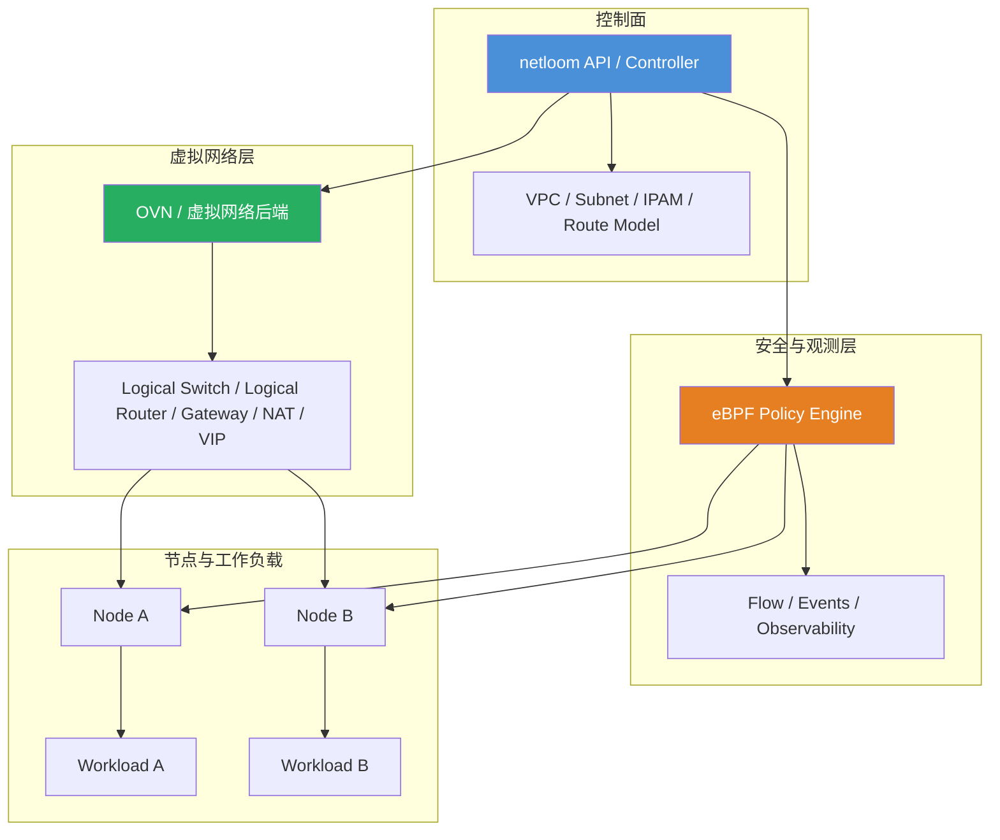

# netloom

[](https://goreportcard.com/report/github.com/jimyag/netloom)
[](https://codecov.io/gh/jimyag/netloom)
[](LICENSE)
[](https://github.com/jimyag/netloom/releases)

`netloom` 是一个使用 Go 编写的 SDN 软件项目。

## netloom 是什么意思

`netloom` 由 `net` 和 `loom` 两部分组成。

- `net` 表示 network，也就是网络。
- `loom` 表示织机，也有“编织”的意思。

所以 `netloom` 想表达的是：像织布一样去编排和组织网络，把原本分散的节点、链路、地址、路由和策略编织成一张可以统一描述、统一控制的虚拟网络。

这个名字更偏控制面语义，而不是单纯强调某个转发协议或某一种数据面实现。它适合用来描述一个负责 VPC、子网、IPAM、路由、网关和策略集成的 SDN 系统。

## 项目愿景

`netloom` 面向云网络和基础设施网络场景，目标是提供一套可编排的虚拟网络控制面，而不是依赖每台机器上的手工网络配置。

当前的方向包括：

- VPC 与虚拟网络抽象
- 子网与 IPAM 管理
- 逻辑交换与逻辑路由
- Gateway 与 NAT 编排
- 与 eBPF 安全策略能力集成

项目整体会保持简单、清晰、易维护：

- 使用 Go 实现控制面
- API 尽量小且行为明确
- 优先使用易读、易调试、易扩展的组件划分

## 架构方向

当前的设计方向，接近 `OVN + eBPF` 的职责拆分。

`netloom` 负责网络控制面的核心能力：

- VPC 与子网建模
- IPAM
- 逻辑网络拓扑
- 路由意图表达
- Gateway 编排
- VIP、负载均衡挂载等服务连接能力

eBPF 负责安全与可观测性相关能力：

- 类安全组的策略执行
- 主机与工作负载级别的包过滤
- 基于连接状态的策略控制
- 流量观测与排障数据

也就是说：

- `netloom` 负责定义网络
- eBPF 负责执行和观测安全策略

这和“Kube-OVN/OVN 负责虚拟网络，Cilium/eBPF 负责策略与观测”的整体思路接近，但 `netloom` 会保持自己的控制面边界和实现方式。

### 架构草图



这张图表达的是：

- `netloom` 作为控制面，负责管理网络模型与编排逻辑。
- OVN 风格的虚拟网络后端，负责实现逻辑交换、逻辑路由、Gateway、NAT 和 VIP。
- eBPF 负责策略执行和流量观测，不负责定义 VPC、子网或 IPAM。
- 工作负载同时受虚拟网络与 eBPF 策略影响，但两者的职责边界保持分离。

## 为什么不把安全策略全部放进 OVN ACL

OVN ACL 本身很适合做分布式虚拟网络策略，但它不是唯一选择。

这里更倾向于这样分工：

- 虚拟网络、地址分配、VPC、路由等能力放在 SDN 控制面
- 更复杂的安全组能力交给 eBPF

这样做的好处是：

- 网络与安全职责边界更清晰
- 更容易获得更强的策略能力和观测能力
- 降低虚拟网络拓扑与安全实现细节之间的耦合

但这并不意味着系统一定更简单。混合架构会增加控制面和排障复杂度，所以两侧的边界必须保持明确，避免出现多套策略系统同时生效、相互覆盖的问题。

## 范围

计划中的能力：

- 建模虚拟网络与子网
- 分配并回收 IP 地址
- 编排逻辑路由与 Gateway 行为
- 与 eBPF 策略引擎集成
- 提供清晰的面向运维和平台的接口

早期阶段的非目标：

- 从零重写所有数据面能力
- 在同一条路径上混用多套重叠策略系统
- 用过重的抽象隐藏控制面行为

## 当前状态

`netloom` 目前仍处于早期阶段，整体架构还在持续收敛，但仓库里已经有一条可运行的端到端路径。

当前仓库已经包含：

- 控制面模型：VPC、Subnet、Endpoint、RouteTable、PolicyRoute、Gateway、NATRule、SecurityGroup、CIDRGroup。
- 控制面一致性校验：拒绝重复的 VPC/Subnet/Endpoint/SecurityGroup/Gateway 等对象身份，拒绝 Endpoint IP 冲突，并在写入后端前校验 VPC、Subnet、安全组、remote-group 和 LoadBalancer 绑定子网等引用关系。
- OVN 风格拓扑后端：把逻辑交换、逻辑路由、静态 ECMP 路由、策略路由、Gateway、NAT、Service VIP 和 Provider Network 转换为带 `external_ids` 所有权标记的批量 `ovn-nbctl` 事务；Gateway 覆盖集中式 chassis pin 与分布式网关元数据；NAT 覆盖 SNAT、DNAT、Floating IP (`dnat_and_snat`) 和 OVN `--portrange` 端口 DNAT，同名规则变更会按 desired state 替换旧 NAT，并在控制面拒绝 EIP/端口冲突。
- Linux 工作负载 datapath：支持本机 `/32`/`/128` 地址路由、`netns + veth` 多工作负载模式，以及基于 RPDB table/rule 的 IPv4/IPv6 策略路由下发；网卡/netns/策略路由操作默认使用 `vishvananda/netlink`/`netns` 后端执行，保留 `NETLOOM_LINUX_DATAPATH_BACKEND=command` 作为 shell 回退路径。
- Cilium 风格策略编译：把安全组规则编译为 endpoint-scoped policy map entry，并把 `remote_cidr`/`remote_group`/`remote_cidr_group`/`remote_fqdns` 保留为可按真实 remote IP 匹配的 CIDR 元数据；重叠 CIDR 会按最长前缀选择更具体规则，精确 identity 命中优先于 CIDR fallback；`remote_cidr` 支持 Cilium `except` 类似的 `except_cidrs` 差集展开；`remote_group` 会展开为 endpoint identity 与精确成员 CIDR，`remote_cidr_group` 会按 desired-state `cidr_groups` 展开为多条 CIDR 规则，`remote_fqdns` 会按 desired-state `dns_records` 展开为 /32 或 /128 CIDR。
- Cilium 风格连接状态：stateful allow 规则会建立反向 conntrack 状态，策略变化或 endpoint 删除时清理旧状态。
- Cilium 风格策略更新：policy map replace 会先计算 add/update/delete/unchanged diff，成功替换后递增 endpoint policy revision 并记录 audit event；内存 store 具备事务回滚语义。
- Cilium 风格可观测性：policy evaluator 会记录 allow/drop/conntrack/log 统计，为策略拒绝或无匹配 drop 生成 drop event，并为带 `log` 的规则或 `action=log` 生成 allow/drop policy event。
- eBPF/TCX ACL datapath：支持节点接口和工作负载 veth 上的 IPv4 CIDR+L4/ICMP ACL attach，TCX map 使用 LPM trie 匹配 peer CIDR，workload fast path 会按 ingress/egress 安全组方向投影到对应 TCX attach 点；IPv6 安全组 CIDR 仍会进入 policy map/evaluator 路径，但当前 IPv4 TCX fast path 会在 attach 前显式拒绝 IPv6 ACL，避免静默漏下发。
- 周期 reconcile：controller 和 agent 都能从 desired-state JSON 文件周期重读状态，controller 会清理从 desired state 删除的 OVN/内存对象，agent 会持有并按需替换 TCX attachment。

策略边界如下：

- `PolicyRoute` 属于 SDN 拓扑意图，由 topology/OVN 路由层处理，支持 reroute/drop 等路由动作；reroute 支持 Kube-OVN/OVN 风格的多 next-hop ECMP，OVN backend 会投影到 `Logical_Router_Policy.nexthops`，Linux datapath 会投影为 multipath policy route；OVN backend 会按 desired state 替换同 priority/match 的 policy，避免 next-hop 或 action 更新后旧策略残留；控制面会拒绝同名策略路由或同一 VPC 内重复 priority/match 的策略路由。
- `RouteTable` 的静态路由会按 destination 先清后写，默认路由、blackhole、单 next-hop 和 OVN `--ecmp` 多 next-hop 更新都会收敛到当前 desired state；控制面会拒绝同一 VPC 内重复 destination 的静态路由，避免 OVN logical router 上出现歧义路由。
- 控制面会拒绝跨 IP family 的无效意图，包括静态路由 destination/next-hop、SNAT CIDR/external IP、DNAT/Floating IP external/target 以及 LoadBalancer VIP/backend 的 IPv4/IPv6 混配。
- Linux datapath 会把本节点本 VPC 的 `PolicyRoute` 下发为独立 route table 和 `ip rule`/netlink rule，支持 source/destination、TCP/UDP `dport`、reroute 和 blackhole/drop；默认 netlink 后端会按 desired state 清理托管表范围内的旧 rule 并刷新当前表，`NETLOOM_POLICY_ROUTE_TABLE_BASE`/`NETLOOM_POLICY_ROUTE_TABLE_SIZE` 可调整表 ID 范围。
- `SecurityGroupRule` 属于 ACL 意图，由 eBPF-style policy map 和 TCX ACL datapath 执行。
- `remote_cidr` 可声明 `except_cidrs`，编译器会把主 CIDR 拆成排除例外后的最小 CIDR 集合；和 Cilium 一样，例外 CIDR 必须包含在主 CIDR 内，且不和 `remote_cidr_group` 混用。
- `remote_cidr_group` 采用 Cilium `CIDRGroupRef` 类似的安全组 CIDR 集合语义，CIDRGroup 作为 desired-state 对象集中维护可复用 CIDR 列表，编译时展开进 endpoint policy map。
- `remote_fqdns` 采用 Cilium `toFQDNs` 类似的安全组 egress 语义，支持 `match_name` 和 `match_pattern`，当前从 desired-state `dns_records` 静态 DNS cache 派生 CIDR policy entry；`match_pattern` 采用 Cilium label wildcard 语义，普通 `*` 不跨 `.`，前缀 `**.` 可匹配一层或多层子域；`dns_records` 可通过 `ttl_seconds` + `observed_at` 表达 DNS cache TTL，过期记录不会编译进策略。还没有实现 Cilium DNS proxy 那种运行时 DNS 观测与自动刷新。
- ACL 不放到 OVN ACL 里实现，避免和 eBPF 策略路径重叠。
- DNAT 端口映射会校验协议意图；当前 OVN NAT schema 只有 `external_port_range`，没有协议列，也不做端口号转换，因此 Netloom 只接受 external/target 端口相同的端口 DNAT，并把同一个 EIP+端口视为冲突。
- 控制面 resolver 会解析 DNAT 和 Floating IP (`dnat_and_snat`) 入站目标，用于在单元测试和 selftest 中验证 Kube-OVN 风格 NAT 语义。
- `LoadBalancer` 使用 OVN `lb-add`/`lr-lb-add`/`ls-lb-add` 表达 Kube-OVN 风格的 VPC Service VIP，控制面会拒绝同 VPC 内重复的 VIP+协议+端口；支持 OVN `affinity_timeout` 形式的 ClientIP session affinity，并支持 Kube-OVN/OVN 风格的 `Load_Balancer_Health_Check` 健康检查选项；backend 可声明 `healthy=false` 从本地 resolver 与 OVN VIP backend 列表中剔除，未声明时默认健康，控制面要求至少保留一个健康 backend；同名 LB 的 VIP、backend 和绑定子网变化会按 desired state 收敛，避免旧 Service VIP 残留。
- 控制面 resolver 会按 VPC、VIP、协议、端口和绑定子网解析 Service VIP，并基于 flow 与 backend 做稳定选择，用于在单元测试和 selftest 中验证负载均衡语义。
- `Subnet` 可以声明 `provider_network` 和 `vlan`，OVN 后端会创建 `localnet` 逻辑端口，用于对接 Kube-OVN 常见的 underlay/provider network 场景；provider/VLAN 变化或 provider 关闭时会重建或删除 localnet port。
- `Subnet` 可以开启 DHCP，OVN 后端会为 endpoint logical switch port 生成并绑定 DHCPv4 options，覆盖 router/server/lease/MTU 等常见 Kube-OVN 子网 DHCP 语义；当 DHCP 关闭时会清空端口 DHCP 绑定，保持 desired state 收敛。

## 开发

### 依赖要求

- Go `1.26+`
- `task` 用于执行下面的便捷命令

### 常用命令

```bash
# 安装开发工具
task deps

# 执行静态检查
task lint

# 执行测试
task test

# 执行跨模块集成测试
task test:integration

# 执行 Docker 多节点 e2e 测试，需要 Docker 和可用的 privileged 容器能力
task test:e2e

# 构建二进制
task build
```

`task test` 会运行所有 Go 包测试，包括 `tests/integration`；`task test:e2e` 会启动 Docker Compose lab，用多个容器模拟节点，验证 OVN Northbound、控制面 state-file、OVN desired-state 删除、基于 netlink 的 Linux netns 工作负载、跨节点连通性、策略路由输出、remote-group 安全组策略、eBPF/TCX ACL drop/allow 和 stale namespace cleanup。

## 参与贡献

参见 [CONTRIBUTING.md](CONTRIBUTING.md)。

## 许可证

[Apache 2.0](LICENSE)
